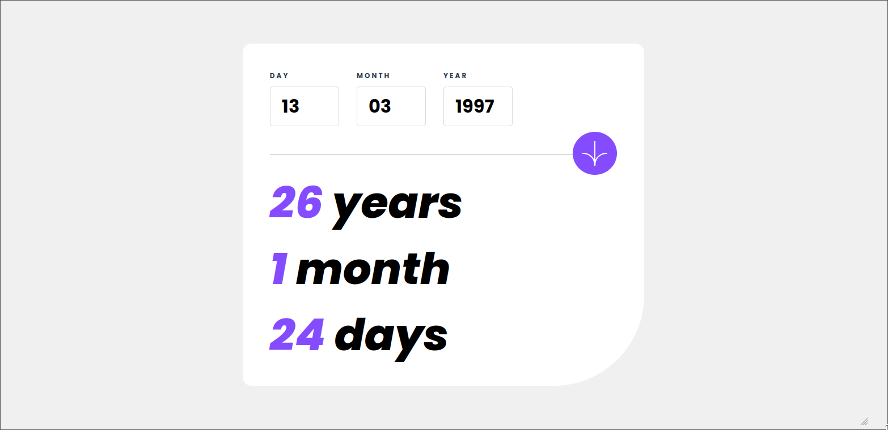

# Frontend Mentor - Age Calculator Web App

This is a solution to the [Age Calculator App challenge on Frontend Mentor](https://www.frontendmentor.io/challenges/age-calculator-app-dF9DFFpj-Q).

## Preview

## Links

- Solution URL: [Solution URL](https://www.frontendmentor.io/solutions/vue-solution-3F9GHMnfSU)
- Live Site URL: [Live Solution](https://age-calc-front-end-mentor.vercel.app/)

## Built with

- Vue.js 3

## Author

- Website - [Jesus Venegas](https://www.jesusvenegas.com) (WIP)
- Frontend Mentor - [@kasdeya](https://www.frontendmentor.io/profile/kasdeya)

## Acknowledgments

- Inspiration by [Front End Mentor](https://www.frontendmentor.io/)

